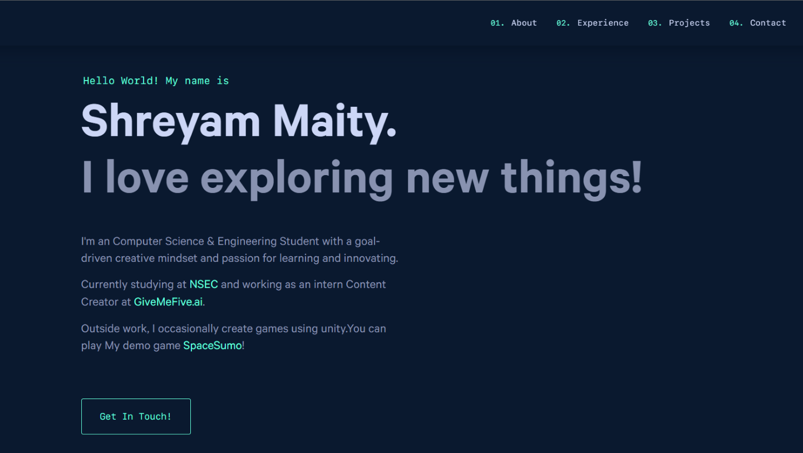

<div align="center">
  
</div>
<h1 align="center">
  Portfolio Website
</h1>
<p align="center">
  The first iteration of <a href="https://shreyam.ml" target="_blank">shreyam.ml</a> built with <a href="https://www.gatsbyjs.org/" target="_blank">Gatsby</a> and hosted with <a href="https://www.netlify.com/" target="_blank">Netlify</a>
</p>
<p align="center">
  <a href="https://app.netlify.com/sites/shreyam/deploys" target="_blank">
    
  </a>
</p>

<div align="center">
  
</div>

### TL;DR

Yes, you can fork this repo. Please give proper credit by linking back to [brittanychiang.com](https://brittanychiang.com).
If you are customizing this website , give a small credit to this repo. Thanks!

## 🛠 Installation & Set Up

1. Install the Gatsby CLI

   ```sh
   npm install -g gatsby-cli
   ```

2. Install and use the correct version of Node using [NVM](https://github.com/nvm-sh/nvm)

   ```sh
   nvm install
   ```

3. Install dependencies

   ```sh
   yarn
   ```

4. Start the development server

   ```sh
   npm start
   ```

## 💻 Customization 

1. Social Media Data:

   goto -> ./src/config.js
   enter your details

2. Loader :

   goto -> ./src/components/icons/loader.js -> line 22
   change position -> line 21
3. Logo :
   goto -> ./src/components/icons/logo.js -> line 19
   change position -> line 18

4. Resume :

   goto -> ./static/resume.pdf

5. Changing Website Data:

   changing front page : 
      goto -> ./content/hero/index.md
   changing about page :
      goto -> ./content/about/index.md
   changing jobs:
      goto -> ./content/jobs/
      add folder & create index.md & paste your details
   changing projects:
      goto -> ./content/projects/
      add your own .md and paste your details
      to show in projects change bool value of showInProjects to true
      to save in archive only  change bool value of showInProjects to false
   changing featured projects :
      goto -> ./content/featured/
      add folder & create index.md , paste your details
      add proper png files

## GitHub Push Instructions

- push to main branch other than master
- master branch will be where the website will get deployed and hosted
- make any changes if you want to and push to main only
- after Depoying the website it will get pushed to master
- to use Netlify , 

## 🚀 Building and Running for Production

1. Generate a full static production build

   ```sh
   gatsby build
   ```

2. Deploy The Website

   ```sh
   npm run deploy
   ```

## 🎨 Color Reference

| Color          | Hex                                                                |
| -------------- | ------------------------------------------------------------------ |
| Navy           |  `#0a192f` |
| Light Navy     |  `#172a45` |
| Lightest Navy  |  `#303C55` |
| Slate          |  `#8892b0` |
| Light Slate    |  `#a8b2d1` |
| Lightest Slate |  `#ccd6f6` |
| White          |  `#e6f1ff` |
| Green          |  `#64ffda` |
